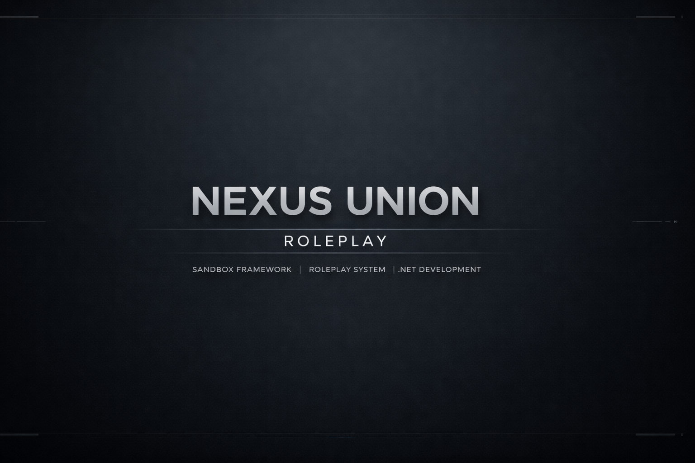

# Nexus Union Public

About (Deutsch)

Nexus Union Roleplay ist ein modulares Roleplay‑Framework, das seinen Schwerpunkt auf Erweiterbarkeit, Performance und eine immersive Benutzeroberfläche legt.
Entwickelt mit C# und modernen Webtechnologien bietet es Kernsysteme wie:

Jobs

Inventar

Berechtigungen

UI‑Framework

Erweiterbare APIs

Ziel ist ein stabiles, modernes und zukunftssicheres RP‑Framework für die S&box‑Community.

---

About (English)

Nexus Union Roleplay is a modular roleplay framework focused on extensibility, performance, and an immersive user interface.
Built with C# and modern web technologies, it provides core systems such as:

Jobs

Inventory

Permissions

UI framework

Extendable APIs

The goal is to deliver a stable, modern, and future‑proof RP framework for the S&box community.

--- 

## License

[MIT](LICENSE) - Copyright (c) 2026 striccer (stricer) / Nexus Union 

---

## In Arbeit... 🚧
Work in Progress... 🚧

