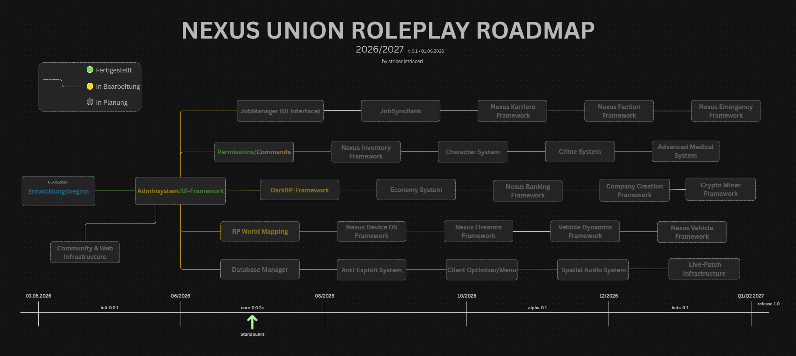

# Nexus Union Public

🇩🇪 Deutsch

Nexus Union Roleplay ist ein modulares Roleplay‑Framework für S&box, entwickelt mit C#, .NET und modernen Webtechnologien.
Das Framework enthält alle Kernsysteme, die ein professioneller Roleplay‑Server benötigt, darunter:

Jobsystem

Adminsystem

UI‑Framework

Commands

Inventarsystem

Berechtigungen / Permissions

Spieler‑Datenverwaltung

Erweiterbare APIs

Das Projekt wird als komplettes Framework entwickelt.
Nur ausgewählte Module (z. B. das Adminsystem oder einzelne Tools) werden öffentlich veröffentlicht.
Der vollständige Framework‑Code bleibt privat und ist ausschließlich für das Nexus‑Union‑Entwicklungsteam bestimmt.

---

🇬🇧 English

Nexus Union Roleplay is a modular roleplay framework for S&box, built with C#, .NET, and modern web technologies.
The framework includes all core systems required for a professional roleplay server, such as:

Job system

Admin system

UI framework

Commands

Inventory system

Permissions

Player data management

Extendable APIs

The project is developed as a complete framework.
Only selected modules (e.g., the admin system or individual tools) will be released publicly.
The full framework code remains private and is intended exclusively for the Nexus Union development team.

--- 

## License

[NUPL](LICENSE) - Copyright (c) 2026 striccer (stricer) / Nexus Union 

---

## In Arbeit... 🚧
Work in Progress... 

